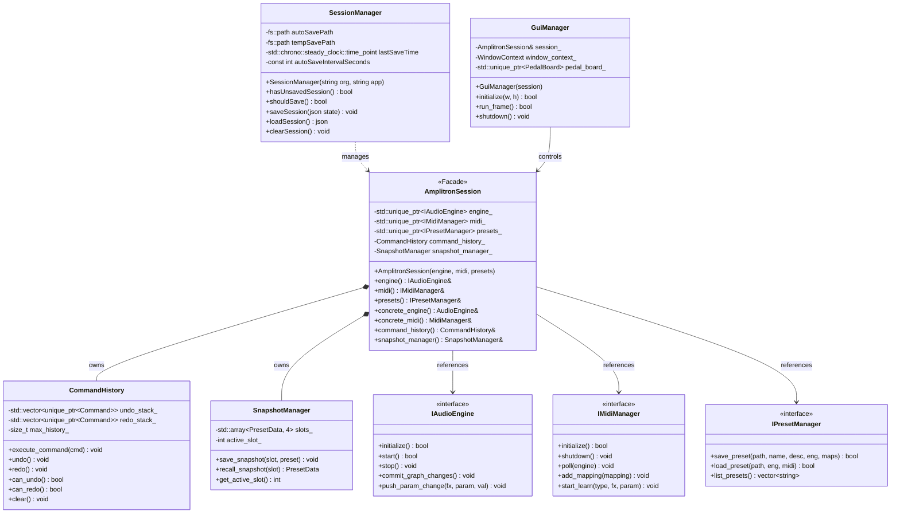
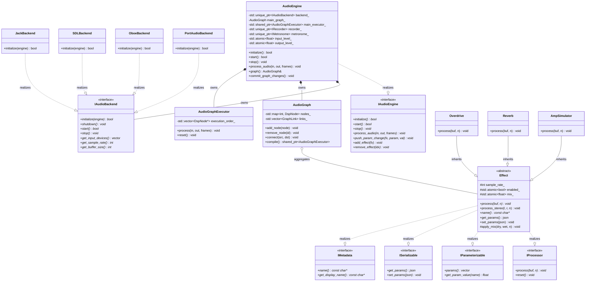
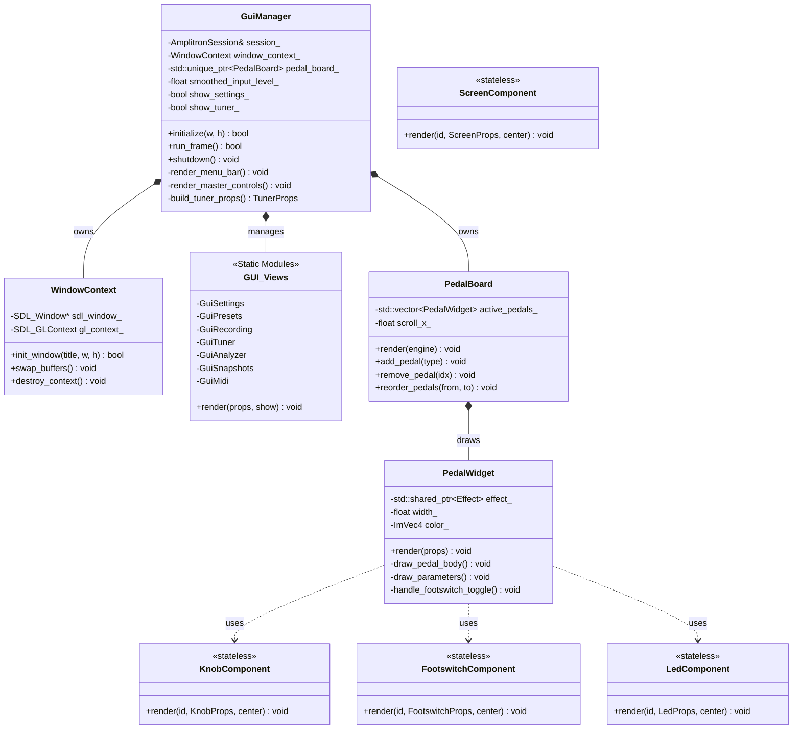

# Amplitron - Guitar Amp Simulator


[](https://github.com/sudip-mondal-2002/Amplitron/actions/workflows/ci.yml)
[](https://codecov.io/gh/sudip-mondal-2002/Amplitron)
[](https://github.com/sudip-mondal-2002/Amplitron/actions/workflows/release.yml)
[](https://opensource.org/licenses/MIT)
[](https://github.com/sudip-mondal-2002/Amplitron/releases)

Professional real-time guitar amplifier simulator with ultra-low latency, 16 studio-quality effects, and a beautiful visual pedal board interface. Available as a native desktop app, Android APK, iOS app, and a browser-based web demo. Built in C++17 with PortAudio, SDL2, and Dear ImGui.

<a href="https://www.producthunt.com/products/amplitron?embed=true&amp;utm_source=badge-featured&amp;utm_medium=badge&amp;utm_campaign=badge-amplitron" target="_blank" rel="noopener noreferrer"></a>

**[Download Latest Release](https://github.com/sudip-mondal-2002/Amplitron/releases/latest)** | **[Visit Website](https://sudip-mondal-2002.github.io/Amplitron/)**

## Table of Contents

- [Platform Downloads](#platform-downloads)
  - [iOS Installation (AltStore)](#ios-installation-altstore)
- [Demo Video](#-demo-video)
- [Features](#features)
  - [Audio Engine](#audio-engine)
  - [Effects Pedals](#effects-pedals)
  - [Utilities](#utilities)
  - [Visual Pedal Board](#visual-pedal-board)
- [Hardware Setup](#hardware-setup)
  - [What is a USB Guitar Cable?](#what-is-a-usb-guitar-cable)
  - [Compatible USB Guitar Cables](#compatible-usb-guitar-cables)
  - [Full Audio Interfaces](#full-audio-interfaces-also-supported)
  - [What You Need](#what-you-need)
  - [Signal Chain](#signal-chain)
  - [How It Works](#how-it-works)
  - [Low-Latency Tips](#low-latency-tips)
- [Building from Source](#building-from-source)
  - [Prerequisites](#prerequisites)
  - [Quick Start](#quick-start)
  - [Build Targets](#build-targets-makefile)
- [Usage](#usage)
  - [Running](#running)
  - [Command-line options](#command-line-options)
  - [Controls](#controls)
  - [Default Signal Chain](#default-signal-chain)
- [Project Structure](#project-structure)
- [Architecture](#architecture)
  - [Audio Pipeline](#audio-pipeline)
  - [DSP Techniques Used](#dsp-techniques-used)
  - [Class Diagram & Subsystems](#class-diagram--subsystems)
- [Troubleshooting](#troubleshooting)
- [Development & Contributing](#development--contributing)
  - [Running Tests](#running-tests)
  - [CI/CD Pipeline](#cicd-pipeline)
  - [Automatic Releases](#automatic-releases)
  - [Contributing](#contributing)
  - [Contact](#contact)
- [License](#license)

### Platform Downloads

| Platform      | File                          | Notes                                                    |
| ------------- | ----------------------------- | -------------------------------------------------------- |
| Windows 10/11 | `Amplitron-Windows-Setup.exe` | Run the installer                                        |
| macOS 10.15+  | `Amplitron-macOS.dmg`         | Drag to Applications; right-click → Open on first launch |
| Linux x64     | `Amplitron-Linux-x64.tar.gz`  | Extract and run `amplitron.sh`                           |
| Android 8.0+  | `Amplitron-Android.apk`       | Enable "Install unknown apps" in Settings                |
| iOS 15.0+     | `Amplitron-iOS.ipa`           | See [iOS installation](#ios-installation-altstore) below |

#### iOS Installation (AltStore)

Apple does not allow installing apps outside the App Store without a paid developer certificate, but [AltStore](https://altstore.io) makes sideloading transparent:

1. Install [AltStore](https://altstore.io) on your iPhone (requires a Mac or PC once for setup)
2. On your iPhone, open the [latest release](https://github.com/sudip-mondal-2002/Amplitron/releases/latest) in Safari and tap `Amplitron-iOS.ipa`
3. Tap **Share → AltStore** to install
4. AltStore auto-refreshes the app certificate in the background as long as your phone and computer are on the same Wi-Fi once a week — no re-installs needed

## 🎬 Demo Video

Watch the first look and demo: **[Amplitron Demo - YouTube](https://youtu.be/OLGx1zYj0W4)**

Transform your computer into a complete guitar rig. Plug in your guitar via USB audio interface or guitar cable, and get instant access to professional amp simulation with studio-quality effects — all with imperceptible latency.

---

## Features

### Audio Engine

- **Ultra-low latency** — default 64-sample buffer at 48kHz (~1.3ms processing latency)
- **Configurable buffer sizes** — 32, 64, 128, 256, 512 samples
- **Sample rates** — 44.1kHz, 48kHz, 96kHz
- **Auto-detection of USB guitar cables** — automatically selects USB input device for guitar, laptop output for speakers
- **Real-time input/output metering**
- **Adjustable input and output gain**
- **Device selection** — choose any PortAudio-compatible input/output device, with USB devices highlighted in the UI

### Effects Pedals

| Pedal             | Description                                                                                                       |
| ----------------- | ----------------------------------------------------------------------------------------------------------------- |
| **Noise Gate**    | Silences signal below threshold with adjustable attack/release                                                    |
| **Compressor**    | Dynamics control with threshold, ratio, attack, release, makeup gain                                              |
| **Overdrive**     | Tube-style asymmetric soft clipping with tone control                                                             |
| **Distortion**    | Hard clipping with tanh waveshaping and tone filter                                                               |
| **Equalizer**     | 3-band parametric EQ (Bass/Mid/Treble/Presence) using biquad filters                                              |
| **Amp Simulator** | Preamp models (Fender Twin, Marshall JCM800, Mesa Rectifier, Roland JC-120) with gain, tone stack, and saturation |
| **Cabinet Sim**   | Speaker cabinet emulation with low/high rolloff and resonance                                                     |
| **Chorus**        | LFO-modulated delay with rate and depth controls                                                                  |
| **Delay**         | Up to 2 seconds, with feedback tone filtering                                                                     |
| **Reverb**        | Schroeder reverb (4 comb + 2 allpass filters) with decay and damping                                              |
| **Wah**           | State-variable filter wah with manual sweep and auto-wah (envelope follower) modes                                |
| **Phaser**        | Cascaded all-pass filters with LFO modulation (4, 6, 8, or 12 stages)                                             |
| **Flanger**       | Short modulated delay line (0.1–15ms) with feedback for comb filter sweep                                         |
| **Octaver**       | Monophonic sub-octave and upper-octave generator with envelope shaping                                            |
| **Pitch Shifter** | Pitch shifting by ±12 semitones using granular overlap-add algorithm                                              |

### Utilities

| Tool                | Description                                                                   |
| ------------------- | ----------------------------------------------------------------------------- |
| **Chromatic Tuner** | YIN pitch detection algorithm with note name, octave, and cent offset display |

### Visual Pedal Board

- **Drag-and-drop style** pedal chain — add, remove, and reorder effects
- **Realistic pedal graphics** — color-coded per effect type with LED indicators
- **Rotary knob controls** — drag vertically to adjust, double-click to reset
- **Footswitch toggle** — click to enable/bypass each pedal
- **Horizontal scrolling** — supports large pedal chains
- **Real-time level meters** — input and output with clipping indicators
- **Spectrum analyzer** — real-time frequency analysis display
- **Undo/redo** — full history tracking for all parameter and chain changes
- **Preset system** — save and load pedal chains as JSON files
- **WAV recording** — record processed output to WAV files
- **Release update checker** — notifies when new versions are available on GitHub

---

## Hardware Setup

### What is a USB Guitar Cable?

A **USB Guitar Cable** (also called a "Guitar-to-USB cable" or "USB Guitar Link") is a single cable with:

- **One end:** 1/4" (6.35mm) mono jack — plugs into your guitar's output
- **Other end:** USB-C (or USB-A) — plugs into your laptop/phone

It contains a tiny built-in audio interface that converts your guitar's analog signal to digital audio. Your computer sees it as a standard USB audio input device. **No separate audio interface or extra cables needed — just plug and play.**

#### Compatible USB Guitar Cables

| Cable                            | Connector         | Notes                                     |
| -------------------------------- | ----------------- | ----------------------------------------- |
| Generic "Guitar to USB-C" cables | USB-C             | Cheapest option, works great for practice |
| Behringer Guitar Link UCG102     | USB-A             | Popular budget option                     |
| IK Multimedia iRig HD 2          | USB-C / Lightning | High quality, works with phones too       |
| Rocksmith Real Tone Cable        | USB-A             | Often found cheap second-hand             |
| Line 6 Sonic Port                | USB-C             | Good quality preamp built in              |

> **Any cable that has a 1/4" guitar jack on one end and USB on the other will work.** The software auto-detects it.

#### Full Audio Interfaces (also supported)

If you already own a desktop audio interface, that works too:

- Focusrite Scarlett Solo / 2i2
- Behringer U-Phoria UMC22 / UMC202HD
- PreSonus AudioBox
- Any USB class-compliant audio interface

### What You Need

1. **Electric guitar** (any guitar with a pickup)
2. **USB Guitar Cable** (1/4" jack → USB-C) — see table above
3. **Laptop** with a USB-C port (or USB-A with adapter)
4. **Headphones** (recommended) or laptop speakers for output

### Signal Chain

```
Guitar ──[1/4" jack]──> USB Guitar Cable ──[USB-C]──> Laptop ──> Guitar Amp Simulator ──> Laptop Speakers / Headphones
```

### How It Works

1. **Plug** the 1/4" end of the USB guitar cable into your guitar
2. **Plug** the USB-C end into your laptop
3. **Launch** Guitar Amp Simulator — it auto-detects the USB cable as input
4. **Play** — your guitar signal is processed through the pedal chain in real-time
5. **Listen** through your laptop speakers or headphones

The software automatically routes:

- **Input:** USB Guitar Cable (your guitar signal)
- **Output:** Laptop speakers / headphones (the processed amp sound)

You can change devices anytime via **File → Settings**.

### Low-Latency Tips

- Use **ASIO drivers** on Windows (install [ASIO4ALL](https://www.asio4all.org/) if your USB cable doesn't include ASIO drivers)
- Set buffer size to **64 samples** (default) or **32 samples** if your CPU can handle it
- Use **48kHz** sample rate for best balance of quality and latency
- **Use headphones** to avoid feedback from laptop speakers picking up guitar sound
- Close other audio applications to reduce CPU contention
- On Linux, consider using **JACK** for professional-grade low-latency audio

---

## Building from Source

### Prerequisites

- **C++17 compiler** (GCC 8+, Clang 7+, MSVC 2019+)
- **CMake** 3.16+
- **Git** (to fetch Dear ImGui)
- **PortAudio** development libraries
- **SDL2** development libraries
- **OpenGL** development headers

### Quick Start

#### Windows (with vcpkg)

```powershell
# 1. Install vcpkg if you haven't
git clone https://github.com/microsoft/vcpkg.git C:\vcpkg
C:\vcpkg\bootstrap-vcpkg.bat
set VCPKG_ROOT=C:\vcpkg

# 2. Install dependencies
vcpkg install portaudio:x64-windows sdl2:x64-windows

# 3. Setup project (fetches Dear ImGui)
.\scripts\setup_dependencies.ps1

# 4. Build
.\scripts\build_windows.ps1

# Or manually:
mkdir build
cd build
cmake -DCMAKE_TOOLCHAIN_FILE=C:\vcpkg\scripts\buildsystems\vcpkg.cmake ..
cmake --build . --config Release
```

#### Linux (Debian/Ubuntu)

```bash
# 1. Install system dependencies
sudo apt-get install build-essential cmake pkg-config \
    libportaudio2 portaudio19-dev \
    libsdl2-dev libgl1-mesa-dev

# 2. Setup project (fetches Dear ImGui)
chmod +x scripts/setup_dependencies.sh
./scripts/setup_dependencies.sh

# 3. Build
make build
# or: make run  (builds and launches)
```

#### Linux (Arch)

```bash
sudo pacman -S base-devel cmake pkg-config portaudio sdl2 mesa
./scripts/setup_dependencies.sh
make build
```

#### macOS

```bash
brew install cmake portaudio sdl2
./scripts/setup_dependencies.sh
make build
```

### Build Targets (Makefile)

| Command          | Description                                     |
| ---------------- | ----------------------------------------------- |
| `make setup`     | Install dependencies (interactive, Linux/macOS) |
| `make build`     | Build Release binary                            |
| `make debug`     | Build Debug binary                              |
| `make run`       | Build and launch                                |
| `make clean`     | Remove build artifacts                          |
| `make rebuild`   | Clean + build                                   |
| `make install`   | Install to `/usr/local/bin`                     |
| `make uninstall` | Remove installed binary                         |
| `make help`      | Show all targets                                |

---

## Usage

### Running

```bash
# Linux / macOS
./build/amplitron

# Windows
.\build\Release\amplitron.exe
```

### Command-line options

| Flag              | Description            |
| ----------------- | ---------------------- |
| `-h`, `--help`    | Print usage and exit   |
| `-v`, `--version` | Print version and exit |

### Controls

- **Menu Bar** → File → Settings to configure audio devices, buffer size, and sample rate
- **+ Add Pedal** button to add effects to the signal chain
- **Knobs** — click and drag vertically to adjust parameters
- **Double-click** a knob to reset it to its default value
- **Footswitch** (circle at bottom of each pedal) — click to toggle bypass
- **X button** (top-right of pedal) — remove pedal from chain
- **Reset All** — reset all pedal parameters to defaults
- **Audio → Start/Stop** — toggle the audio stream
- **File → Copy Preset to Clipboard** — serialise the current pedal chain to JSON and copy to clipboard for easy sharing
- **M** — quickly mute/unmute the audio stream while the main window is focused

### Default Signal Chain

The application starts with a clean acoustic preset. Only EQ and Reverb are enabled by default — all other effects start bypassed:

```
Input → [Noise Gate] → [Compressor] → [Overdrive] → EQ → [Cabinet] → [Delay] → Reverb → Output

> Brackets [ ] = bypassed by default. Only **EQ** and **Reverb** are active on startup.
> Click any pedal's footswitch in the GUI to enable it.
```

(\*bypassed by default — click the footswitch to enable)

AmpSimulator and Wah are available via **+ Add Pedal** and can be inserted anywhere in the chain.

You can remove any pedal and add new ones in any order.

---

## Project Structure

```
Amplitron/
├── CMakeLists.txt                 # Build configuration
├── Makefile                       # Convenience wrapper
├── CLAUDE.md                      # Developer guidelines and architecture doc
├── CODE_OF_CONDUCT.md             # Contributor Covenant
├── LICENSE                        # MIT License
├── docs/
│   ├── index.html                 # Download page (GitHub Pages)
│   ├── PRESETS.md                 # Preset guide
│   └── demo/                      # Web demo (deployed)
├── external/                      # Vendored deps (fetched by setup script)
├── presets/                       # Example presets (JSON)
├── scripts/                       # Build/Package scripts
├── src/
│   ├── main.cpp                   # Entry point
│   ├── common.h                   # Shared math/DSP utilities
│   ├── cli.h                      # Command-line arguments parser
│   ├── session_manager.h          # Lifecycle and auto-save coordinator
│   ├── audio/                     # Audio DSP and drivers
│   │   ├── backend/               # Platform audio backends (PortAudio, Oboe, SDL)
│   │   ├── dsp/                   # Base DSP filters and loaders (Biquad, FFT convolution)
│   │   ├── effects/               # Base effect interface & 16 pedal DSP agents
│   │   ├── engine/                # Core processing engine & graph executor
│   │   ├── recorder/              # Audio recorder and WAV flusher agents
│   │   └── utils/                 # Low-level queue thread primitives (SPSC)
│   ├── gui/                       # User Interface orchestrator (SDL2 / Dear ImGui)
│   │   ├── commands/              # Command pattern undo/redo stack agents
│   │   ├── components/            # Atomic, reusable visual elements (Knob, Footswitch, Screen)
│   │   ├── dialogs/               # Native/Web file selector windows
│   │   ├── pedalboard/            # Visual pedal canvas and interactive pedal board
│   │   ├── state/                 # Snapshot managers and dynamic state orchestrators
│   │   ├── theme/                 # Scaling metrics and color palettes
│   │   └── views/                 # Top-level windows, overlays, and sidebars
│   ├── midi/                      # MIDI CC managers and learning persistence
│   └── presets/                   # JSON serialization and Preset managers
├── tests/                         # Full test suite (590 tests)
│   ├── test_framework.h           # Headless-safe unit test framework
│   ├── test_fixtures.h            # Mock engines and standard chains
│   ├── test_mocks.h               # Proxy effects and bypass stubs
│   ├── unit/                      # Isolated unit tests for DSP and commands
│   ├── integration/               # Multi-component state integration tests
│   ├── ui/                        # Visual headless simulation and event loop tests
│   └── web/                       # Playwright end-to-end web demo tests

└── web/
    ├── shell.html                 # Emscripten shell template
    └── coi-serviceworker.js       # SharedArrayBuffer support
```

---

## Architecture

### Audio Pipeline

The audio callback runs at the highest priority available from PortAudio. The signal flow is:

1. **Input** — mono float32 samples from the audio interface
2. **Input Gain** — adjustable preamplifier
3. **Effect Chain** — each enabled effect processes the buffer sequentially
4. **Output Gain** — master volume control
5. **Safety Clamp** — hard limit to ±1.0 to prevent clipping damage
6. **Output** — mono float32 to the audio interface

Effects use `try_lock` on the mutex to avoid blocking the audio thread if the GUI is modifying the chain. This ensures glitch-free audio even during UI interaction.

### DSP Techniques Used

- **Biquad filters** — for EQ bands (low shelf, peaking, high shelf) and amp tone stacks
- **One-pole filters** — for tone controls and parameter smoothing
- **Schroeder reverb** — 4 parallel comb filters + 2 series allpass filters
- **Waveshaping** — `tanh()` and polynomial soft clipping for drive effects
- **Linear interpolation** — for fractional delay reads (chorus, delay)
- **Envelope following** — for noise gate, compressor, and amp simulator dynamics
- **YIN pitch detection** — for chromatic tuner (4096-sample window at 48kHz)
- **Amp modeling** — per-model tone stacks, saturation curves, power sag simulation

### Class Diagram & Subsystems

Amplitron is structured into modular components separating audio processing, GUI layout, preset management, and MIDI handling. Below are the class diagrams representing the primary subsystems, their class relationships, and design patterns, rendered natively using Mermaid:

#### 1. Core Coordination (Facade & Subsystems)

This diagram shows the system managers and their lifecycles coordinate via the unified `AmplitronSession` facade, which isolates the GUI layer from the implementation details of each subsystem.



#### 2. Audio Subsystem & DSP Pipeline

This diagram shows how the `AudioEngine` interfaces with backends (`IAudioBackend`), delegates execution order via `AudioGraph` / `AudioGraphExecutor`, and processes pedal modules which implement the `Effect` base class.



#### 3. GUI Subsystem (Atomic Component Pattern)

This diagram shows the relationship between `GuiManager`, window context handlers, view overlays, and the `PedalBoard` which renders `PedalWidget` components built on top of stateless atomic GUI primitives like `KnobComponent`, `FootswitchComponent`, and `LedComponent`.



---

## Troubleshooting

### USB Guitar Cable not detected

- **Unplug and replug** the USB-C end — some cables need a moment to initialize
- Check that the cable appears in your OS sound settings:
  - **Windows:** Settings → Sound → Input — look for "USB Audio Device" or similar
  - **Linux:** `arecord -l` or check PulseAudio/PipeWire settings
  - **macOS:** System Preferences → Sound → Input
- The console output on launch lists all detected devices with `[USB]` tags — check if your cable appears
- If auto-detection misses it, open **File → Settings** and manually select it as input
- Try a different USB-C port (some ports may not support USB audio)

### No audio / "Failed to open stream"

- Make sure the USB guitar cable is plugged in **before** launching the app
- Open **File → Settings** and verify both input (USB cable) and output (speakers) are selected
- On Windows, install [ASIO4ALL](https://www.asio4all.org/) for better driver support
- Try increasing the buffer size to 128 or 256 if you hear crackling
- Make sure no other app (e.g., a DAW) has exclusive access to the USB device

### I hear my guitar but also a lot of noise

- Turn up the **Noise Gate** threshold (first pedal in the default chain)
- Cheap USB guitar cables can introduce some noise — this is normal, the noise gate handles it
- Keep the USB cable away from power adapters and screens (electromagnetic interference)

### Feedback / echo from speakers

- **Use headphones** — this is the #1 fix
- If using laptop speakers, lower the output volume and move the laptop away from the guitar
- The guitar's magnetic pickup can pick up speaker vibrations, causing a feedback loop

### High latency (delay between playing and hearing)

- Reduce buffer size: **File → Settings → Buffer Size → 64 or 32**
- Use ASIO drivers on Windows (install ASIO4ALL)
- Close other audio-intensive applications (browsers, Spotify, DAWs)
- Use **48kHz** sample rate

### Crackling / glitches

- Increase buffer size to 128 or 256
- Lower sample rate to 44100 Hz
- Check CPU usage — disable effects you aren't using
- On laptops, ensure power mode is set to **High Performance**

### Build errors / missing `external/` directory

- The `external/` directory is **not checked into Git** — it is fetched by the setup script
- On a fresh clone, you **must** run the setup script before building:
  ```bash
  # Linux / macOS
  ./scripts/setup_dependencies.sh
  # Windows
  .\scripts\setup_dependencies.ps1
  ```
- This fetches: Dear ImGui, kiss_fft, dr_wav, and nanosvg into `external/`
- `git submodule update` will **not** work — these are not Git submodules
- On Windows with vcpkg, ensure `VCPKG_ROOT` is set and you pass the toolchain file to CMake

---

## Development & Contributing

### Building from Source

See the platform-specific build instructions above. The project uses CMake and requires:

- C++17 compiler
- PortAudio
- SDL2
- OpenGL

### Running Tests

```bash
cd build
./amplitron-tests        # Linux/macOS
./amplitron-tests.exe    # Windows
```

The test suite includes 105+ tests covering:

- Core utility functions
- All 16 audio effects (including amp simulator, wah, tuner, phaser, flanger, octaver, and pitch shifter)
- Preset save/load/roundtrip
- WAV recording
- Theme and color system
- Undo/redo command history
- End-to-end web demo tests (Playwright, in `tests/web/`)

### CI/CD Pipeline

Amplitron uses GitHub Actions for continuous integration and deployment:

- **CI Workflow** (`.github/workflows/ci.yml`): Runs on every push to `main`/`develop` and PRs to `develop`
  - Builds on Windows (MSYS2/MinGW64), macOS (Homebrew), Linux (Ubuntu), Android (NDK r27), iOS (Xcode Simulator), and Web (Emscripten)
  - Runs full test suite (105+ tests) on all native desktop platforms
  - Generates semantic version (`0.1.<commit_count>`)
  - Uses dependency caching (apt, Emscripten SDK, ccache)
  - Uploads build artifacts (1-day retention)

- **Release Workflow** (`.github/workflows/release.yml`): Triggered automatically on successful CI on `main`
  - Creates GitHub Release with semantic version tag
  - Packages platform-specific installers:
    - **Windows**: NSIS installer (`Amplitron-Windows-Setup.exe`)
    - **macOS**: DMG disk image (`Amplitron-macOS.dmg`) with ad-hoc code signing
    - **Linux**: Tarball (`Amplitron-Linux-x64.tar.gz`) with launcher script
    - **Android**: APK (`Amplitron-Android.apk`) — sideload directly
    - **iOS**: IPA (`Amplitron-iOS.ipa`) — install via AltStore
  - Deploys web demo and download page to GitHub Pages

### Automatic Releases

Every push to `main` automatically:

- Builds for Windows, macOS, Linux, Android, iOS, and Web (Emscripten)
- Runs the full test suite (105+ tests)
- Creates a new release with version `v0.1.<commit_count>`
- Uploads platform installers/packages to the release
- Deploys the download page and web demo to GitHub Pages

No manual tagging required — just push to `main` and get a release!

### Contributing

Contributions are welcome! Please:

1. Fork the repository
2. Create a feature branch
3. Make your changes with tests
4. Submit a pull request

For bugs and feature requests, open an issue on GitHub.

### Contact

- **Developer**: Sudip Mondal
- **Email**: sudmondal2002@gmail.com
- **GitHub**: [@sudip-mondal-2002](https://github.com/sudip-mondal-2002)

---

## License

This project is licensed under the [MIT License](LICENSE). The audio DSP algorithms are original implementations based on well-known techniques from the audio engineering literature.

**Dependencies:**

- [PortAudio](http://www.portaudio.com/) — MIT License
- [SDL2](https://www.libsdl.org/) — zlib License
- [Dear ImGui](https://github.com/ocornut/imgui) — MIT License
